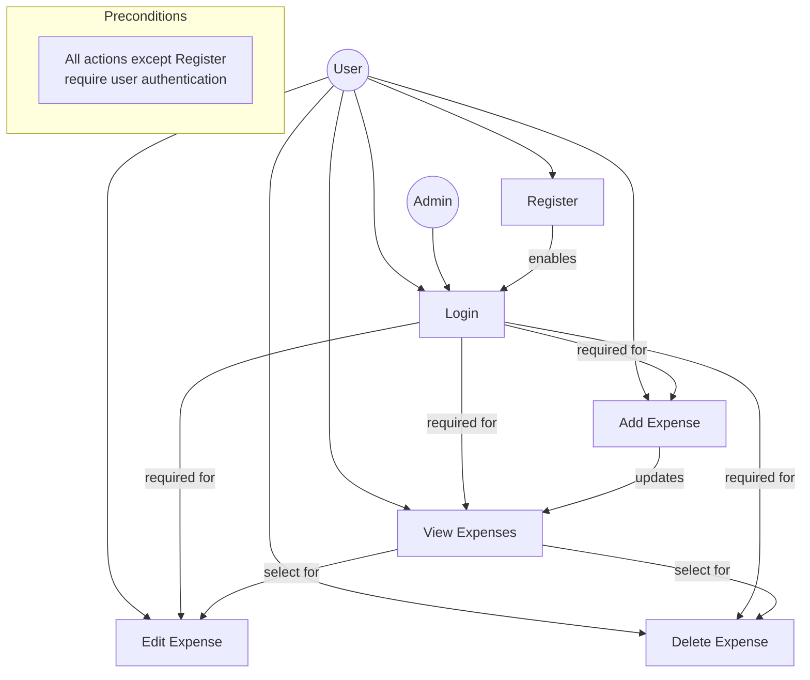
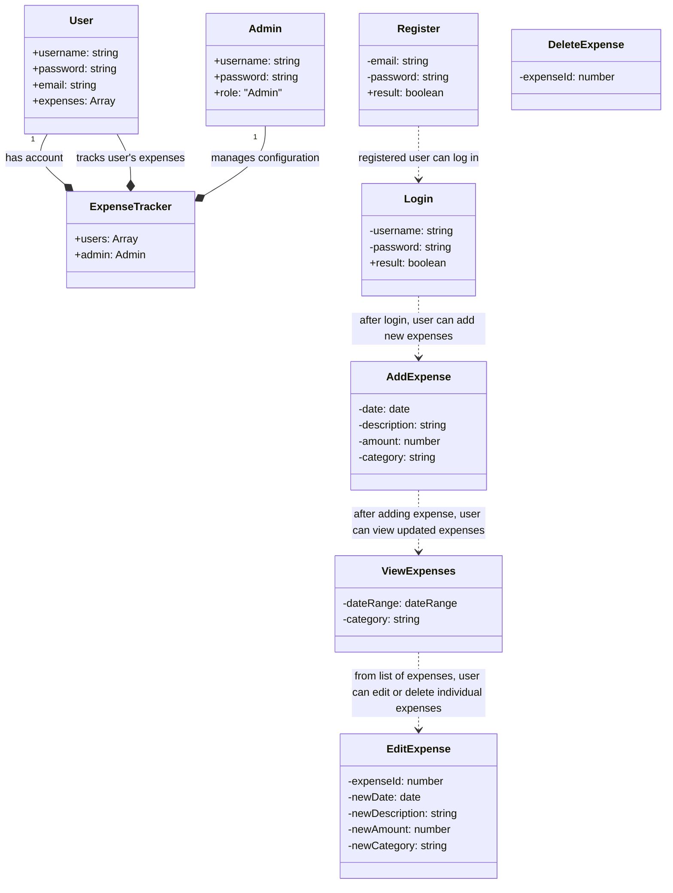
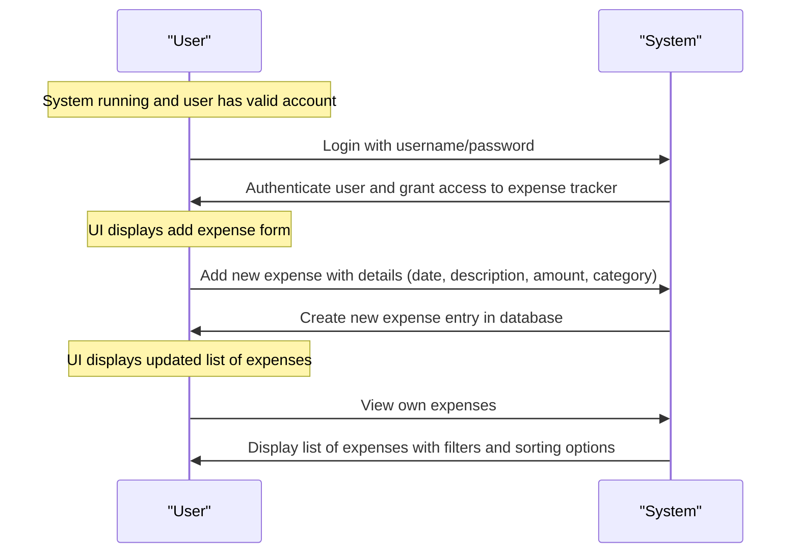

# Design

At every stage of development we can and should review decisions made in previous stages to ensure that they are still valid and beneficial. Doing this early can save a lot of time and effort later on when changes are required or the solution does not meet the requirements.

## User Activity Diagram

This Mermaid diagram provides a visual representation of the user activity flow in your application. It includes actors (User and Admin), use cases (Login, Register, Add Expense, View Expenses, Edit Expense, Delete Expense), and relationships between them. The diagram also shows dependencies between use cases and notes on preconditions for certain actions.

## Class Diagram

This diagram shows the relationships between different classes and their interactions within an expense tracking system. It includes classes for login, registration, adding expenses, viewing expenses, editing expenses, and deleting expenses. The `ExpenseTracker` class is central to managing these operations for a user or admin.

## Sequence Diagrams
Sequence diagrams are used to show the flow of messages between objects over time. They help in understanding how different components interact with each other in a specific scenario. Below is an example of creating a new expense in the expense tracking system.

[< Prev: Requirements](./requirements_and_analysis.md) | [Next: Implementation >](./implementation.md)