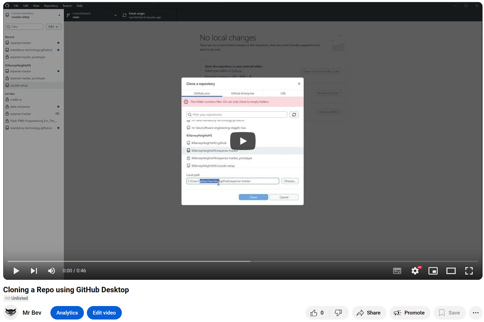

# Implementation

The actual implementation can be found in the `src` directory. The main entry point is the `app.py` file, which sets up the application and starts the server.

## Getting Started

The easiest way to get started is to run this project in [codespaces](#codespaces) following the description below.

If you want to run this locally, follow the steps in the [local](#local) section below

## Requirements

- VSCode
- Python 3.8 or later
- pip (Python package installer)
- git (Version Control System)
- [Python profile for VSCode (optional)](https://github.com/KillarneyHeightsHS/vscode-setup/blob/main/profiles/python.code-profile)

## Codespaces

1. Choose `Code > Codespaces > Open codespace` from the repository.
2. Change directory to `src\expense_tracker`.

   ```
   cd src\expense_tracker
   ```

3. Run `python -m flask db upgrade`
   This should result in a database being created with the needed schema. You can check this by selecting the file `~/src/instance/expenses.db`
4. Run `flask run --debug`
5. In your terminal window you should see a link to `http://127.0.0.1:5000`. Click on it and you can start to play with the expense tracker.

> [!Note]
> Your database is temporary and will be lost when you end your session in codespaces. If you don't want to lose your data, download a copy of the database before ending your session.

## Local

### Step 0. Python Installation

Ensure you have python installed on your system. Instructions for this can be found [here](https://code.visualstudio.com/docs/python/python-tutorial).

### Step 1. Clone the repository

Use either github desktop or the command line to clone the repository.

```
git clone https://github.com/KillarneyHeightsHS/expense-tracker.git
```

[](https://www.youtube.com/watch?v=SUuYRbGf1UA "Clone using GitHub Desktop")

> [!TIP]
> It can help you organise your repositories if you have a dedicate location for them. Eg `C:\Users\<username>\repos` or `~/repos`.

### Step 2. Initialise the Virtual Environment

It is helpful to create a virtual environment for your project. This will help you manage dependencies and avoid conflicts with other projects.

Windows:

```
python -m venv .venv
.venv\Scripts\activate
```

Linux / MacOS:

```
python3 -m venv .venv
source .venv/bin/activate
```

### Step 3. Install Dependencies

By maintaining a clean and organised `requirements.txt` file, you can easily manage all the dependencies required for your project. This ensures that everyone working on the project has the same versions of libraries installed.

```
pip install -r requirements.txt
```

### Step 4. Run the Application

Once everything is set up, you can run the application by executing the `app.py` file.

```
flask run --debug
```

This is the first test you should do to ensure that everything is working correctly. Testing is a crucial part of any development process and helps catch bugs early on.

What you should see is a message indicating that the server has started, along with the port number it is listening on. You can then open a web browser and navigate to `http://localhost:5000` to view your application in action.

[< Prev: Design](./design.md) | [Next: Serving a webpage >](./serving_a_webpage.md)
