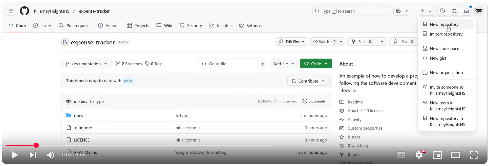

# Starting from the Beginning

## Step 1. Create a new project.
It is recommended that you create a new project in github, to simplify setting up version control. To do this go to github and click on the "+" icon in the upper right corner. Select "New repository" and follow the prompts to create a new repository.

[](https://www.youtube.com/watch?v=th8KpEoxQVk "Create a Repository")

If you don't want to use a git repository, you can create a new folder on your local machine and navigate to it in a terminal window.

In a terminal window, navigate to the location where you want to create your project and run the following command:
```
mkdir expense_tracker
cd expense_tracker
```
## Step 2. Initialise a new Git repository. (Optional)

You can skip this if you have created a git repository in step 1.

> [!TIP]
> Even if you don't use version control, it is still a good idea to initialize a Git repository. This will allow you to easily switch to version control later if you decide to do so.

To keep track of changes to your code, you can initialize a new Git repository by running the following commands:
```
git init 
git add README.md
git commit -m "Initial commit"
```

## Step 3. Folder Structure.

Create a folder structure for your project. A simple structure might look like this:

```
expense_tracker/
├── .venv/
├── docs/
│   ├── requirements_and_analysis.md
│   ├── design.md
│   ├── implementation.md
│   ├── testing.md
│   └── ... 
├── src/
|   ├── expense_tracker
│   │   ├── app.py
│   │   ├── extensions.py
│   │   ├── ...
|   ├── test/
|   ├── static/
│   └── templates/
├── tests/
|   ├── test_expenses.py
|   └── test_routes.py
├── LICENSE
├── README.md
├── requirements.txt
└── .gitignore
```

## Step 4. Create a `requirements.txt` file.
Create a `requirements.txt` file to list all the Python packages that your project depends on. For example:

```python
flask==3.1.0
```

## Step 5. Add a `.gitignore` file. (optional)

Add a `.gitignore` file to specify which files and directories should be ignored by Git. For example, you might want to ignore the `venv/` directory that is created when you create a virtual environment.

## Step 6. Create a README.md file.
Create a README.md file to provide an overview of your project and instructions on how to set it up and run it. 

## Step 7. Setup a virtual environment (optional)
For Windows:
```
python -m venv .venv
.venv\Scripts\activate
```
For macOS/Linux:
```
python3 -m venv .venv
source .venv/bin/activate
```

## Step 8. Install dependencies.
Install any dependencies listed in your `requirements.txt` file.
```
pip install -r requirements.txt
```


## Step 9. Create a `app.py` file under the folder `src/expense_tracker`
```python
from flask import Flask, render_template

app = Flask(__name__)

@app.route('/')
def index():
    return render_template('index.html')

if __name__ == '__main__':
    app.run(debug=True)
```

This is a basic Flask application that serves an HTML page. The `render_template` function is used to render the `index.html` file, which should be located in the `templates/` directory.

## Step 10. Create an `index.html` file.
Create an `index.html` file in the `src/expense_tracker/templates/` directory with the following content:

```html
<!DOCTYPE html>
<html lang="en">
<head>
    <meta charset="UTF-8">
    <meta name="viewport" content="width=device-width, initial-scale=1.0">
    <title>My Expense Tracker</title>
</head>
<body>
    <h1>Welcome to My Expense Tracker</h1>
    <p>This is a simple expense tracker application.</p>
</body>
</html>
```

## Step 11. Run the Flask application.
Ensure you are in the `src/expense_tracker` directory before running the application.

Run the Flask application by executing the following command in your terminal:
```
python app.py
```

[< Prev: Implementation](./implementation.md) | [Next: Refactor for Extensibility and Scalability >](./refactor_for_extensibility_and_scalability.md)
