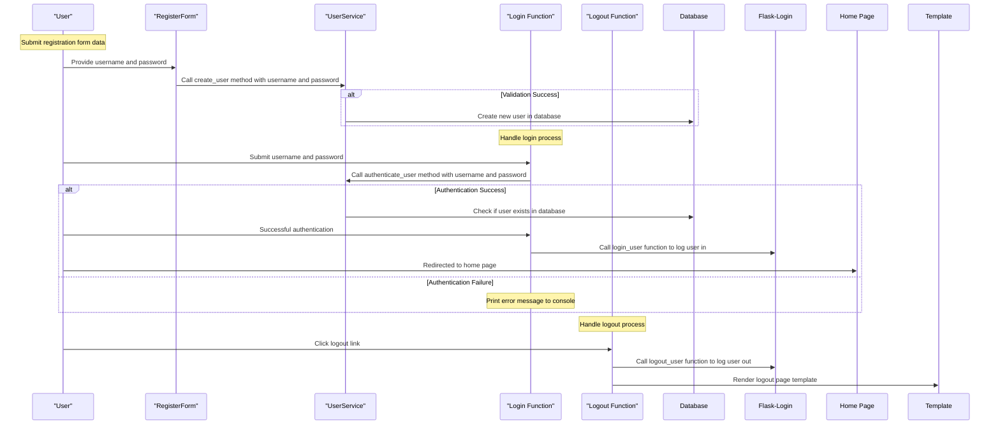

# User Authorisation Frontend

Now that we have a backend for user authorisation, it's time to create the frontend that will interact with this backend. This frontend will be responsible for displaying the login and registration forms, as well as handling the authentication process.

## Step 1: Create the base template

We are going to use [jinja2](https://jinja.palletsprojects.com/) templating engine to create our site to improve the user experience and make it more interactive. We will also use [Bootstrap](https://getbootstrap.com/docs/5.3/getting-started/introduction/) to make our site responsive.

1. Create the file `base.html` in the folder `templates`. This file will contain the common elements of all pages such as header, footer, etc. 

```html
<!DOCTYPE html>
<html lang="en">
<head>
    <meta charset="UTF-8">
    <meta name="viewport" content="width=device-width, initial-scale=1.0">
    <title>My Expense Tracker</title>
    <link href="https://cdn.jsdelivr.net/npm/bootstrap@5.2.3/dist/css/bootstrap.min.css" rel="stylesheet" integrity="sha384-rbsA2VBKQhggwzxH7pPCaAqO46MgnOM80zW1RWuH61DGLwZJEdK2Kadq2F9CUG65" crossorigin="anonymous">
</head>
<body class="container">
    
    
    <script src="https://cdn.jsdelivr.net/npm/bootstrap@5.2.3/dist/js/bootstrap.bundle.min.js" integrity="sha384-kenU1KFdBIe4zVF0s0G1M5b4hcpxyD9F7jL+jjXkk+Q2h455rYXK/7HAuoJl+0I4" crossorigin="anonymous"></script>
</body>
</html>
```

The base template `templates/base.html` is used to provide a consistent layout for all pages. It includes the Bootstrap CSS and JavaScript files, as well as a block where the content of each page will be inserted.

## Step 2: Home Page for Logged In Users

We want a home page `templates/home.html` after login that has a navigation bar. See [NavBar](https://getbootstrap.com/docs/5.2/components/navbar/) for examples of different navigation bars.

```html



<nav class="navbar navbar-expand-lg bg-light">
    <div class="container">
      <a class="navbar-brand" href="#">Expense Tracker</a>
      <button class="navbar-toggler" type="button" data-bs-toggle="collapse" data-bs-target="#navbarText" aria-controls="navbarText" aria-expanded="false" aria-label="Toggle navigation">
        <span class="navbar-toggler-icon"></span>
      </button>
      <div class="collapse navbar-collapse" id="navbarText">
        <ul class="navbar-nav me-auto mb-2 mb-lg-0">
          <li class="nav-item">
            <a class="nav-link active" aria-current="page" href="#">Home</a>
          </li>
          <li class="nav-item">
            <a class="nav-link" href="#">Add Expense</a>
          </li>
          <li class="nav-item">
            <a class="nav-link" href="#">Reports</a>
          </li>
          <li class="nav-item">
            <a class="nav-link" href="#">Settings</a>
          </li>
        </ul>
        <a class="btn btn-primary" href="/" role="button">Logout</a>
      </div>
    </div>
  </nav>


```
Note the use of `{extend "base.html" %}` to extend the base template. This allows us to reuse the layout of the base template while only having to specify the content that is unique to this page. Using `` and `` indicates that the content within this block will replace the `` in the base template.


We also want to prevent from access the home page so we need to make to following changes in `app.py`

```python
from flask import Flask, render_template
import logging

from flask_login import login_required   #import the login_required decorator               <-- add this line

from config import config, Config
from extensions import db, migrate, login_manager, csrf     #                               <-- add in csrf
from services import UserService
# ...
    migrate.init_app(app, db)  # Initialize Flask-Migrate with Flask app and SQLAlchemy
    csrf.init_app(app)  # Initialize Flask-WTF CSRF protection with Flask app               <-- add this line
# ...
    @app.route('/home')
    @login_required     # Protect the route with login_required decorator                   <-- add this line
    def home():
        logger.info("Rendering the home page")
        return render_template('home.html')
# ...
```

We also need to add in the 3rd party module `Flask-WTF` to provide CRSF support and form data validation. Add the following line to `requirements.txt`

```
Flask-WTF==1.2.2
```

Lastly as we are using the Factory pattern, we need to add CSRF to the `extensions` module.

```python
from flask_sqlalchemy import SQLAlchemy
from flask_migrate import Migrate
from flask_bcrypt import Bcrypt
from flask_login import LoginManager
from flask_wtf.csrf import CSRFProtect              # <-- add this line


db = SQLAlchemy()
migrate = Migrate(db)
bcrypt = Bcrypt()
login_manager = LoginManager()
csrf = CSRFProtect()                               # <-- add this line
```

If you run your application now and try to access the home page, you see an access denied message because the user is not logged in. We will fix this by creating a login page and handling user authentication.

## Step 3: Landing Page

Create a landing page `templates\index.html` that displays a welcome message and links to the login page.

``` html




<div class="container mt-5">
    <h1>Welcome to My Expense Tracker</h1>
    <p>This is a simple expense tracker application.</p>
    <p>Login or register to get started.</p>
    <a href="auth/login">Login</a>
    <a href="auth/register">Register</a>
</div>


```

## Step 4: User Registration

Create a registration page `templates\register.html` that allows users to create a new account.

``` html




<div class="container mt-5"></div>
    <h1>Welcome to the Registration Page</h1>
    <form action="/auth/register" method="post">
        <input type="hidden" name="csrf_token" value="{{ csrf_token() }}"/>
        <div class="row mb-3">
          <label for="inputEmail3" class="col-sm-2 col-form-label">Email</label>
          <div class="col-sm-10">
            <input type="email" class="form-control" id="username" name="username">
          </div>
        </div>
        <div class="row mb-3">
          <label for="inputPassword3" class="col-sm-2 col-form-label">Password</label>
          <div class="col-sm-10">
            <input type="password" class="form-control" id="password" name="password">
          </div>
        </div>
        <button type="submit" class="btn btn-primary" value="Register">Register</button>
    </form>
</div>


```

Notice that we have added a hidden input field with the CSRF token to prevent cross-site request forgery attacks. CSRF token is a unique, secret value that is generated for each user session and included in every form submission. It helps to ensure that the request is coming from the same user who initiated it and not from an attacker trying to impersonate them.

The `name` attribute of the input fields is used to identify them when the form is submitted. The `value` attribute of the button is used to specify the action that should be taken when the button is clicked.


## Step 5: Create the Login Page

Create a login page `templates\login.html` that allows users to log in with their credentials.

``` html




<div class="container mt-5">
<h1>Login</h1>
<form action="/auth/login" method="post">
    <input type="hidden" name="csrf_token" value="{{ csrf_token() }}"/>
    <label for="username">Username:</label><br>
    <input type="text" id="username" name="username"><br>
    <label for="password">Password:</label><br>
    <input type="password" id="password" name="password"><br><br>
    <input type="submit" value="Login">
</form>
</div>

```

## Step 6: Create the Logout Page

Create a logout page `templates\logout.html` that logs out the user and redirects them to the landing page.

``` html
<!DOCTYPE html>
<html lang="en">
<head>
    <meta charset="UTF-8">
    <meta name="viewport" content="width=device-width, initial-scale=1.0">
    <title>Logout Page</title>
</head>
<body>
    <h1>You have been logged out.</h1>
    <p><a href="/">Go back to the homepage</a></p>
</body>
</html>
```

## Step 7: Implementing Login and Logout Logic

Our backend needs to manager the user sessions and validate the credentials entered by the user during the login process. Lets replace the contents of `auth.py` with the following code:

```python
from flask import Blueprint, redirect, render_template, url_for, request
from flask_wtf import FlaskForm
from flask_login import login_user, logout_user
from wtforms import StringField, PasswordField, SubmitField
from wtforms.validators import InputRequired, Length, ValidationError
from extensions import bcrypt
from services import UserService

userService = UserService()

auth_bp = Blueprint("auth", __name__, url_prefix="/auth", template_folder="templates")


class RegisterForm(FlaskForm):
    username = StringField(
        validators=[InputRequired(), Length(min=4, max=20)],
        render_kw={"placeholder": "Username"},
    )

    password = PasswordField(
        validators=[InputRequired(), Length(min=8, max=20)],
        render_kw={"placeholder": "Password"},
    )

    submit = SubmitField("Register")

    def validate_username(self, username):
        existing_user_username = userService.get_user_by_email(username.data)
        if existing_user_username:
            print(existing_user_username)
            raise ValidationError(
                "That username already exists. Please choose a different one."
            )


class LoginForm(FlaskForm):
    username = StringField(
        validators=[InputRequired(), Length(min=4, max=20)],
        render_kw={"placeholder": "Username"},
    )

    password = PasswordField(
        validators=[InputRequired(), Length(min=8, max=20)],
        render_kw={"placeholder": "Password"},
    )

    submit = SubmitField("Login")


@auth_bp.route("/login")
def login():
    return render_template("login.html")


@auth_bp.route("/login", methods=["POST"])
def login_post():
    form = LoginForm(request.form)
    if form.validate():
        username = form.username.data
        password = form.password.data
        user = userService.get_user_by_email(username)
        if user and bcrypt.check_password_hash(user.password, password):
            login_user(user)
            return redirect("/home")
        else:
            print(
                f"Invalid user or {user.password} {bcrypt.generate_password_hash(password)}",
                "error",
            )
    else:
        print(f"{request.method} invalid form submission! {form.errors}")

    return redirect("/")


@auth_bp.route("/logout")
def logout():
    logout_user()
    return render_template("logout.html")


@auth_bp.route("/register", methods=["GET", "POST"])
def register():
    form = RegisterForm(request.form)
    if request.method == "POST":
        if form.validate():
            username = form.username.data
            password = form.password.data
            userService.create_user(username, password)
            return redirect(url_for("auth.login"))
        else:
            print(f"{request.method} invalid form submission! {form.errors}")

    return render_template("register.html")

```

There is a lot going on here but the main point is that we are trying to create a user registration and login system. 

The `RegisterForm` class is used to validate the form data submitted by the user during registration. If the form data is valid, the `create_user` method of the `userService` object is called with the username and password provided by the user. This method creates a new user in the database with the provided credentials. The `login` function handles the login process. It checks if the submitted username and password match any user in the database using the `authenticate_user` method of the `userService` object. If the authentication is successful, the `login_user` function from Flask-Login is called to log the user in, and they are redirected to the home page. If the authentication fails, an error message is printed to the console. The `logout` function handles the logout process. It calls the `logout_user` function from Flask-Login to log the user out and then renders a template for the logout page.



The `alt` keyword is used to create alternative branches or paths, which can be useful for representing conditional logic. In this sequence diagram, the alt blocks represent the two possible outcomes of the validation and authentication processes

[< Prev: Authentication Backend](./user_auth_backend.md) | [Next: Expense Tracking >](./expense_tracking.md)